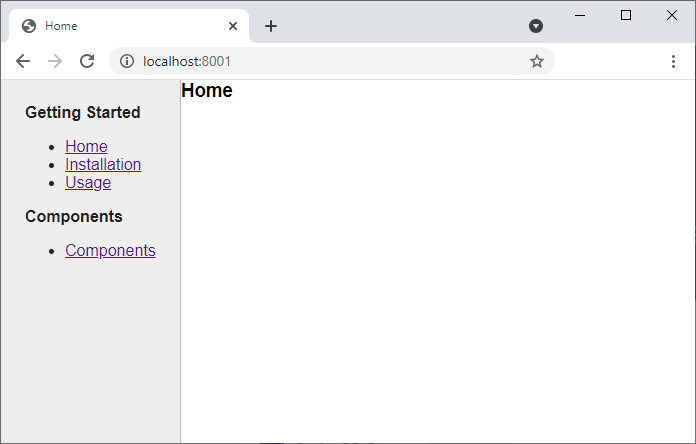
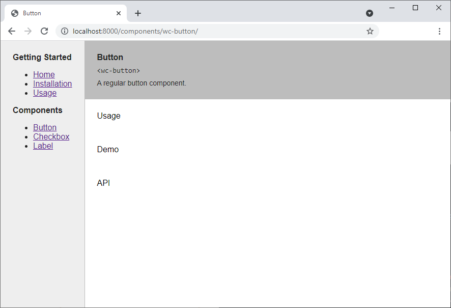

# Tutorial

Now that you have everything [set up](Introduction.md), let's have a look at how to create a simple documentation site for some fictitious web components.

## Creating the Home Page

All templates (layouts, includes and regular pages) are expected to be named `{something}.template.js`. The default page should be called `index.template.js` and be placed in the root of the source folder. Here's a minimal page:

```javascript
const { html } = require('@quark/quark-doc');

const config = {
    layout: 'default',
    title: 'Home'
}

const render = (data, include) => html`
    <h1>Home</h1>
`;

module.exports = {
    config: config,
    render: render,
};
```

All templates (layouts, includes and regular pages) will have a similar structure, with the parts as follows:

Firstly, we import the `html` tagged template literal from `@quark/quark-doc` which does a bit of magic when creating template markup.

```javascript
const { html } = require('@quark/quark-doc');
```

Then we create the `config` object which provides various bits of information to the page generator. For now we'll just provide the layout to use (corresponds to a file `_layouts/default.template.js`) and a title for the page.

```javascript
const config = {
    layout: 'default',
    title: 'Home'
}
```

Next, the `render` function returns the markup for the page, which is inserted into the template. Don't worry about the `data` and `include` parameters yet, we'll get to them when we cover using data and includes. The template just returns some static markup at the moment, but it can be parameterized like any other JavaScript tagged template literal string.

```javascript
const render = (data, include) => html`
    <h1>Home</h1>
`;
```
> The `render` function above returns a string but it can also return an array of strings, which will result in multiple pages being generated. We'll look at how to do this later (there's a few other things that need to be done to make it work properly).

Finally, create a module export with the config and render function:

```javascript
module.exports = {
    config: config,
    render: render,
};
```

## Creating the Layout Page

The layout template page should be placed in the `_layouts` folder and be called `default.template.js` (you can call it anything, as long as it ends with `.template.js`).

```javascript
const { html } = require('@quark/quark-doc');

const config = {
}

const render = (data, include) => {
    return html`
        <!DOCTYPE html>
        <html lang="en">
        <head>
            <meta charset="UTF-8">
            <meta http-equiv="X-UA-Compatible" content="IE=edge">
            <meta name="viewport" content="width=device-width, initial-scale=1.0">
            <title>${data.title}</title>
        </head>
        <body>
            ${data.content}
        </body>
        </html>
    `;
};

module.exports = {
    config: config,
    render: render,
};
```

The structure is exactly the same as the home page, except the `config` object is empty for now. Layouts can't be nested, so it can't specify a layout page of its own, and it inherits the title from the content page. The `data` parameter of the `render` function for a layout template will always have the following 3 properties:

* title: The `title` defined by the content page (the home page, in this case).
* content: The markup returned by the content page `render` function.
* $: This will be set to whatever data is defined by the layout `data` property in the `config` definition.

The layout content itself is just a regular HTML page, with the `title` and `content` injected in the appropriate places. The template can be as simple or as complicated as you need it to be - all you need to do is inject the `content` wherever it makes sense.

## Adding Styles to the Layout Page

You can do the styling however you want, but the easiest is probably to just create an external stylesheet and copy it to the destination folder. Create a `style` folder in the source folder and add a `styles.css` file with the following content (just some basic reset stuff mainly).

```css
* {
    box-sizing: border-box;
}

html, body {
    padding: 0;
    margin: 0;
    height: 100vh;
}

body {
    font-family: sans-serif;
    background-color: #FAFAFA;
}

h1, h2, h3, h4, h5, h6 {
    margin: 0;
}
```

Modify the `quark-doc.config.js` file to copy the CSS file to the root of the destination folder.

```javascript
const config = {
    srcDir: 'docs_src',
    destDir: 'docs',
    copy: [
        {
            src: './docs_src/style/styles.css',
            dest: 'styles.css'
        }
    ]
}
```

> The `copy` property is an array of objects that have a source (relative to the project root) and destination (relative to `destDir`) folder.

The stylesheet is included in the `head` section of `default.template.js` in the normal way.

```html
<link rel="stylesheet" href="/styles.css">
```

We'll come back to this file a lot.

## Navigation

We'll keep things simple and have a navigation pane on the left and the page content on the right. The navigation will consist of a `Getting Started` section, which will have an `Installation` and a `Usage` page, and a `Components` section that will have links for all of the components.

* Getting Started
  * Installation
  * Usage
* Components
  * Button
  * Checkbox
  * Etc.

The 2 pages in the `Getting Started` section will be created from separate page templates like the `home` page, but the individual component pages will be generated from a single template.

Before getting into the navigation, let's just quickly stub out the `Installation`, `Usage` and `Components` template pages. In the source root folder create the following files (note that  the components template is in a `components sub-folder):

* installation.template.js
* usage.template.js
* components/components.template.js

Add the following code to each one, replacing "TITLE" with "Installation", "Usage" or "Components" as appropriate.

```javascript
const { html } = require('@quark/quark-doc');

const config = {
    layout: 'default',
    title: 'TITLE'
}

const render = (data, include) => html`
    <h1>TITLE</h1>
`;

module.exports = {
    config: config,
    render: render,
};
```

If you run a build now you'll see the following structure in the output folder:

* components
    * components
        * index.html
* installation
    * index.html
* usage
    * index.html
* index.html
* styles.css

### More on the Layout Page

The layout page (`default.template.js`) needs to show the navigation pane on the left and the content on the right. We'll implement the actual navigator as an include, but the layout page still needs to have a nice little flexbox layout to keep everything in its place. Let's do that first. Replace the `<body>` tag in the layout page template with the following:

```html
<body>
    <article class="layout-main">
        <section class="layout-navigator">
            <span>Navigator</span>
        </section>

        <section class="layout-content">
            ${data.content}
        </section>
    </article>
</body>
```
 And add the following to the `styles.css` file:

 ```css
.layout-main {
    display: flex;
    align-items: stretch;
    height: 100%;
}

.layout-navigator {
    padding: 24px;
    color: #212121;
    background-color: #EEEEEE;
    border-right: 1px solid #BDBDBD;
}

.layout-content {
    flex: 1;
    background-color: #FFFFFF;
}
 ```

 It's nothing fancy and pretty self explanatory, and gets the job done.

 ### What are Includes?

 An `include` is just a template whose content (markup) gets injected into a layout or page template. You can think of them as a kind of component. As mentioned before, we'll use an `include` to implement the navigator for our component documentation site. Create a file called `navigator.template.js` in the `_includes` folder with the following content (for now):

 ```javascript
const { html } = require('@quark/quark-doc');

const render = (data) => html`
    <span>TODO</span>
`;

module.exports = {
    render: render,
};
 ```
> Note: `Includes` don't have a `config` section.

 To use an `include`, you first need to list it in the template `config` section:

 ```javascript
const config = {
    include: ['navigator']
}
 ```

 You then use it in the `render` function by calling a function on the "include" parameter with the same name as the `include`, like so:

 ```javascript
const render = (data, include) => {
    return html`
        <!DOCTYPE html>
        <html lang="en">
        <!-- head tag -->
        <body>
            <article class="layout-main">
                <section class="layout-navigator">
                    ${include.navigator()}
                </section>
                <section class="layout-content">
                    ${data.content}
                </section>
            </article>
        </body>
        </html>
    `;
};
 ```
`Includes` can be placed in sub-folders in the `_includes` folder, but when you use them the name must be the underscore separated path. e.g. 
`_includes/foo/bar.template.js` will be used as follows"

 ```javascript
const config = {
    include: ['foo_bar']
}

const render = (data, include) => {
    return html`
        <div>
            ${include.foo_bar()}
        </div>
    `;
};
 ```

 ### The Navigator Include - First Pass

 The `navigator` will display the various pages as links within category sections, and will need the data to create the links. `Includes` can't have their own data (they don't even have a `config` object) so it needs to be passed from the parent (the `layout` page, in this case) when the include is rendered.

 First, we need to create the data object that contains the navigation information. Create a file called `navigatordata.js` in the `_data` folder with the following content:

 ```javascript
module.exports = () => {
    return {
        categories: [
            {
                label: 'Getting Started',
                pages: [
                    {
                        url: '/',
                        label: 'Home'
                    },
                    {
                        url: '/installation/',
                        label: 'Installation'
                    },
                    {
                        url: '/usage/',
                        label: 'Usage'
                    }
                ]
            },
            {
                label: 'Components',
                pages: [
                    {
                        url: '/components/components/',
                        label: 'Components'
                    }
                ]
            }
        ]
    };
};
 ```

It's just a module that exports an array of categories, with each category having an array of pages (with a label and url). The components page is just a placeholder for now because we'll generate multiples pages (one for each component) later. The navigation data is imported by the `layout` page by setting the `data` property in the `config` object.

```javascript
const config = {
    include: ['navigator'],
    data: 'navigatordata'
}
```

The data is then passed to the navigator include like so:

```javascript
${include.navigator(data.$.categories)}
```

> **A Note on Data**
> 
>The `data.$.categories` syntax may seem a bit weird, so here's how it works (there's a whole section on it in the full documentation). The `data` specified in a page template is passed straight to the page render function as the `data` parameter (as you would expect), but in the case of a layout page, it's a little different. A layout page render function `data` parameter is an object containing the title (from the page using the layout), the content (the rendered page), the path of the page and the `data` specified by the layout page (which is attached to the `$` field of the data object).

Finally, we can fill out the `render` function of the navigator `include`, which maps each category that has at least one page to an `h4` and `ul`, and maps each page in the category to a `li` containing an anchor tag. Pretty simple, actually.

```javascript
const { html } = require('@quark/quark-doc');

const render = (data) => {
    return html`
        ${data.filter(category => category.pages && category.pages.length > 0).map(category => html`
            <h4>${category.label}</h4>

            <ul>
            ${category.pages.map(page => html`
                <li><a href="${page.url}">${page.label}</a></li>
            `)}
            </ul>
        `)}
    `};

module.exports = {
    render: render,
};
```

If you run the docs site now it'll look something like this:



Nothing fancy (it could do with some styling, but we'll leave that for later), but it does the job. You can now navigate around the 4 pages.

## The Components

The whole point of this tutorial is to display component documentation and all we've done is create a single page that says `Components`, so let's look at that now.

### Defining the Components

To keep things simple we'll just use simplified fake component data to illustrate the important concepts. Obviously real component data will be far more complex and generated by some tool from your real components (usually JSDoc comments). Created a file called `componentdata.js` in the `_data` folder and fill it with about 3 components something like below:

```javascript
module.exports = () => {
    return [
        {
            name: 'Button',
            tagName: 'wc-button',
            summary: 'A regular button component.',
            properties: [
                {
                    summary: 'The text to display on the button.',
                    name: 'caption',
                    type: 'String',
                    defaultValue: 'OK',
                    attribute: 'caption'
                },
            ],
            methods: [
                {
                    summary: 'Clicks the button.',
                    name: 'click',
                    parameters: [
                        {
                            name: 'data',
                            type: 'Object',
                            defaultValue: 'null',
                        }
                    ],
                    return: 'void'
                },
            ],
            cssVariables: [
                {
                    summary: 'The background color of the button.',
                    name: '--button-background-color',
                    type: 'color',
                    defaultValue: '#0000FF'
                },
                {
                    summary: 'The foreground color of the button.',
                    name: '--button-foreground-color',
                    type: 'color',
                    defaultValue: '#FFFFFF'
                }
            ]
        },
        // Other Components
    ]
};
```

It's pretty self-explanatory, but just a lot to put on the page. I'll work with a button, checkbox and label.

### Adding the Component Data to the Components Template

Open the `components.template.js` file the the `components` folder and update the `config` object like so:

```javascript
const config = {
    layout: 'default',
    title: 'Components',
    data: 'componentdata'
}
```

To check that the data is being passed through correctly, you can just log it to the console in the `render` function.

```javascript
const render = (data, include) => {
    // Log to the console.
    console.log(data);
    
    return html`
        <h1>Components</h1>
    `
};
```

### Generating Multiple Pages from a Single Template

Currently, each template results in a single page being generated because the `render` functions return a single string containing the page content. You can generate multiple pages by returning an array of content objects. We'll want to generate a separate content string for each component definition in the data array and return them as an array.

The array objects must have the following fields:

* content: The markup string for the page, as before.
* title: The title for the generated page.
* name: The name for the generated page.

All of the pages will be generated in a parent folder with the same name as the template folder and use the same layout template. The code below is the most simple example using the component data (just displays the component name and tag name).

```javascript
const { html } = require('@quark/quark-doc');

const config = {
    layout: 'default',
    title: 'Components',
    data: 'componentdata'
}

const render = (data, include) => {
    return data.map(component => {
        return {
            title: component.name,
            name: component.tagName,
            content: html`
                <div>${component.name} - ${component.tagName}</div>
            `
        }
    });
};

module.exports = {
    config: config,
    render: render,
};
```

This will generate the following files:

* {destDir}/components/wc-button/index.html
* {destDir}/components/wc-checkbox/index.html
* {destDir}/components/wc-label/index.html

The "Components" link of the navigator is now broken because that page no longer exists, so we need to fix that.

### The Navigator Include - Second Pass

We can't hardcode the component links, so we need to get them from the `componentdata.js` file. We can import them in the `navigatordata.js` file like so:

```javascript
const components = require('./componentdata')();

const componentPages = components.map(component => {
    return {
        url: `/components/${component.tagName}/`,
        label: component.name
    }
});
```

And then update the module export.

```javascript
module.exports = () => {
    return {
        categories: [
            {
                label: 'Getting Started',
                pages: [
                    {
                        url: '/',
                        label: 'Home'
                    },
                    {
                        url: '/installation/',
                        label: 'Installation'
                    },
                    {
                        url: '/usage/',
                        label: 'Usage'
                    }
                ]
            },
            {
                label: 'Components',
                pages: componentPages
            }
        ]
    };
};
```

Now the navigator works as expected.

## The Component Page

Everything is in place now and all that needs to be done is to fill out the detail in the pages. The component pages are the most complex, so let's get that out of the way first. Each component page will have the following 3 sections:

* Usage: The component documentation.
* Demo: A demo of the component (obviously fake because we don't actually have components).
* API: Generated from the fake component data.

Each of the 3 sections will be implemented as an include. The API include is easy because it's completely data driven so you only need one. The other 2 are specific to each component, so there needs to be separate "usage" and "demo" includes for each component. We'll look at how to manage page specific includes when we get to it, but we'll start with the API documentation.

### Basic Component Page

Before we do anything fancy, we need to create the basic page structure, which will consist of a header section, and the "usage", "demo" and "API" sections mentioned before. The markup and CSS below will do for now.

```html
<article class="component">
    <!-- Header -->
    <section class="component-header">
        <h4>${component.name}</h4>
        <div class="component-header-tag-name">&lt;${component.tagName}&gt;</div>
        ${component.summary ? html`<div class="component-header-summary">${component.summary}</div>`: null}   
    </section>

    <!-- Placeholders -->
    <div class="component-scroll-area">
        <section class="component-content">Usage</section>
        <section class="component-content">Demo</section>
        <section class="component-content">API</section>
    </div>
</article>
```

```css
.component {
    display: flex;
    flex-direction: column;
    height: 100%;
}

.component-scroll-area {
    flex: 1;
    overflow-x: hidden;
    overflow-y: auto;
}

.component-header {
    padding: 24px;
    color: #212121;
    background-color: #BDBDBD;
}

.component-header-tag-name {
    margin-top: 8px;
    font-family: monospace;
    font-size: 14px;
}

.component-header-summary {
    margin-top: 8px;
    font-size: 14px;
}

.component-content {
    padding: 24px;
}
```

If you run it now it should look like this.



### The API Documentation Include

TODO

### The Usage Includes

TODO

### The Demo Includes

TODO